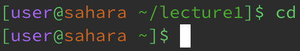
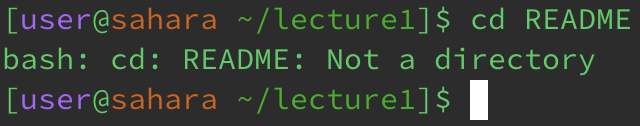
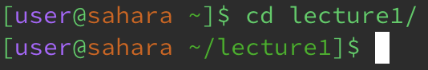
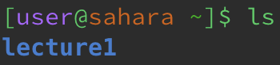
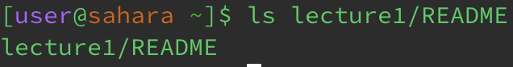
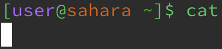
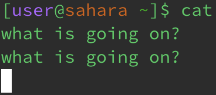
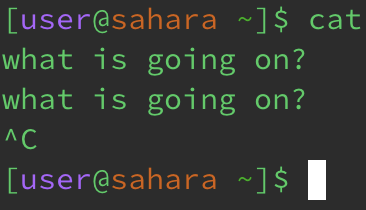
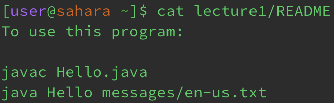
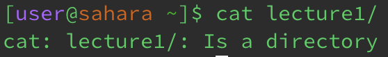

## Lab Report 1
### cd (no args)
- Working directory: ~/lecture1
- When the cd command is run with no arguments, the directory is changed to the home directory (~), as seen in the prompt on the next line.
- This is not an error.

### cd file
- Working directory: ~/lecture1
- When the cd command is run with a file as an argument, it does not change directory and outputs that the file is not a directory.
- This is an error because cd requires a directory to change to, not a file.

### cd dir
- Working directory: ~
- When the cd command is run with a directory as an argument, it changes the directory to the given directory.
- This is not an error.

### ls (no args)
- Working directory: ~
- When the ls command is run with no arguments, it outputs the contents of the current working directory.
- This is not an error.

### ls file
- Working directory: ~
- When the ls command is run with a file as an argument, it outputs the path of the file.
- This is an error, because this command is used to see the contents of a directory and a file is not a directory.

### ls dir
- Working directory: ~
- When the ls command is run with a directory as an argument, it outputs the contents of the given directory.
- This is not an error.

### cat (no args)
- Working directory: ~
- When the cat command is run with no args, it seems like it does nothing. But the prompt is gone.

- We notice that we can actually type in the command, and when we give some input, it echoes it back!
We see that the command has not completed and allows us to keep giving input and receiving output.

- We can return to the prompt by aborting the command using ^C (control C).

- In summary, the cat command, when run with no arguments, just outputs the input until it is aborted.
- This is an error because the user most likely does not want to output the input.
### cat file
- Working directory: ~
- When the cat command is run with a file as an argument, it outputs the contents of the given file.
- This is not an error.

### cat dir
- Working directory: ~
- When the cat command is run with a directory as an argument, it outputs that the path is a directory.
- This is an error because this command is used to output the contents of one or multiple files concatenated together and not directories.

