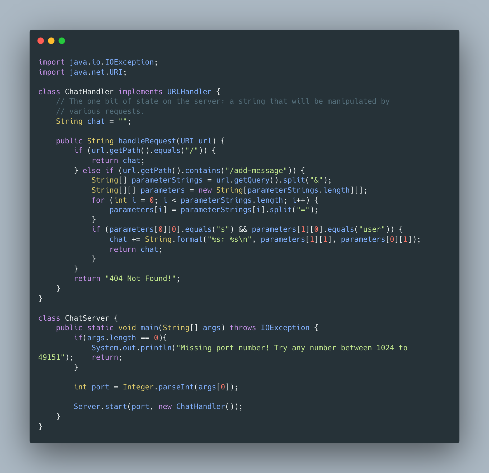
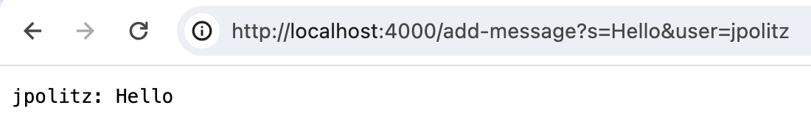
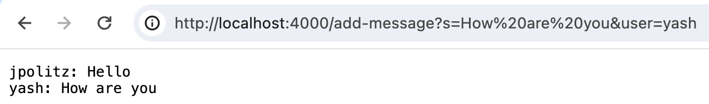
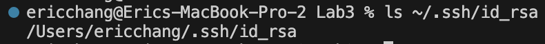
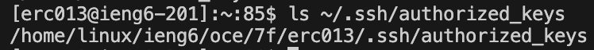
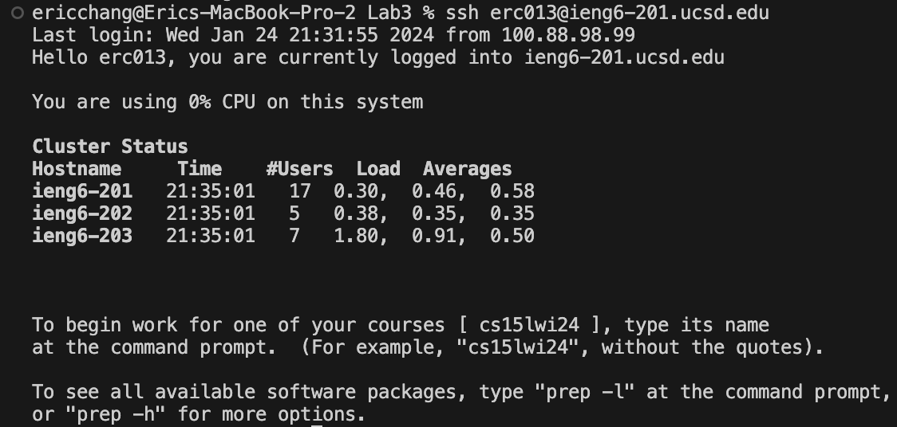

## Lab Report 2
### Part 1

- In both screenshots the `handleRequest` method of the `ChatHandler` class is called.
- Both are supplied with a URI argument. The relevant parts of the URI are the path and the query.
    - For the first request, the path is `/add-message` and the query consists of the message `"Hello"` and the user `"jpolitz"`
    - For the second request, the path is also `/add-message` and the query consists of the message `"How are you"` and the user `"yash"`
- The relevant field of the class is the string `chat` holding the chat history. It is initially the empty string `""`.
    - The first request added the first message to `chat` in the format shown in the screenshot
    - The second request added the second message to `chat` in the same way on a new line

### Part 2
The absolute path to the private key:

The absolute path to the public key:

Logging into my account without being asked for a password:

### Part 3
In the week 2 and week 3 labs, I learned in more detail the specific parts of a URL. I also refreshed my memory of commands that I have used before but not frequently, like `ssh` and `scp`.
