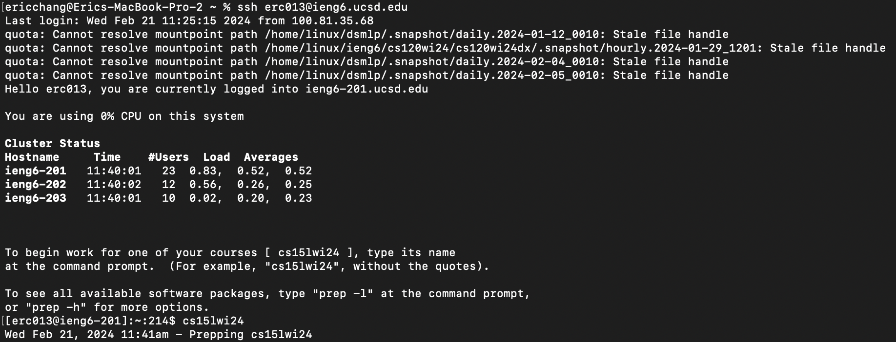
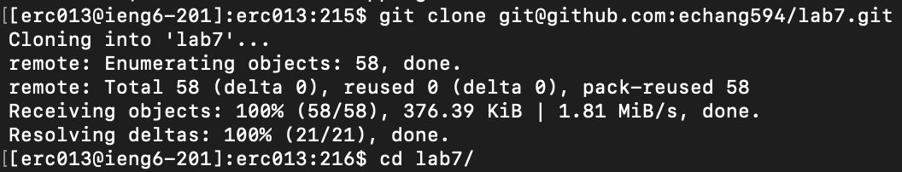
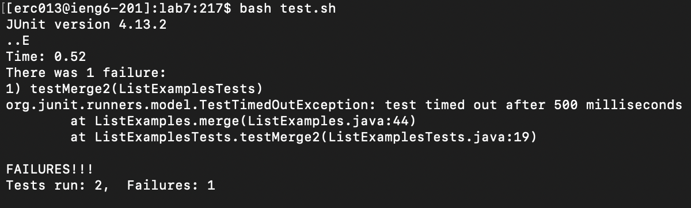
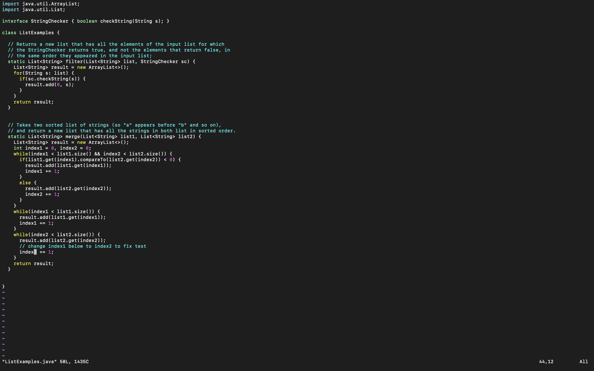
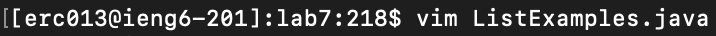
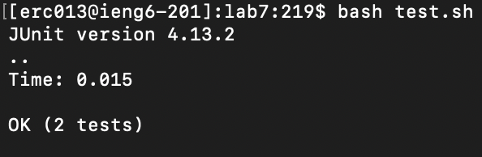
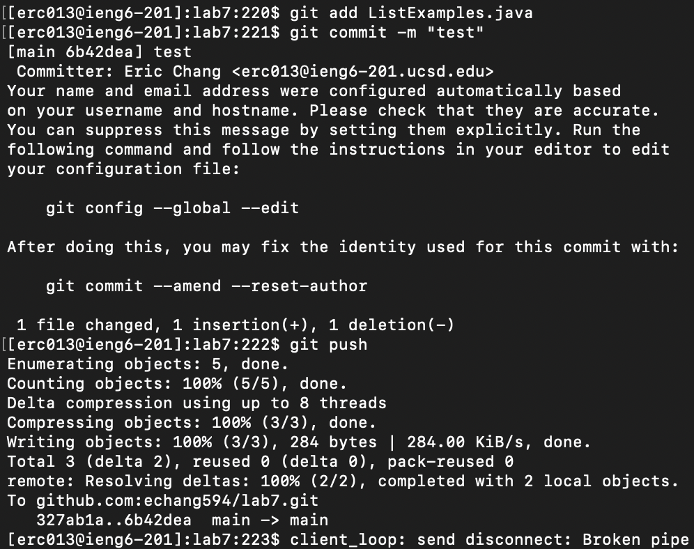

# Lab Report 4
## Log into ieng6


Keys pressed:
```
ssh erc013@ieng6.ucsd.edu<enter>
cs15lwi24<enter>
```
I used `ssh` to connect to the server, then I went into the workspace for this class.
## Clone your fork of the repository from your Github account (using the SSH URL)


Keys pressed:
```
git clone <ctrl+v><enter>
cd l<tab><enter>
```
I cloned my fork of the repository by using `git clone`. The SSH key was already copied into my clipboard. I then navigated to the directory of the repository using `cd`.
## Run the tests, demonstrating that they fail


Keys pressed:
```
bash t<tab><enter>
```
I used `bash` to run the test script.
## Edit the code file to fix the failing test



Keys pressed:
```
vim L<tab>.<tab><enter>
r2:wq<enter>
```
I opened the file in `vim` and used tab to autocomplete `ListExamples.java`. I had gone through the steps previously so my cursor was already on the wrong character. I used `r` in normal mode and replaced the `1` with a `2`. Then I saved the file and quit vim using `:wq`.
## Run the tests, demonstrating that they now succeed


Keys pressed:
```
<up><up><enter>
```
I ran the tests again using the same command as earlier, which was the second last command in the history.
## Commit and push the resulting change to your Github account


Keys pressed:
```
git add <tab><enter>
git commit -m "test"<enter>
git push<enter>
```
I used `git add` to add the file to the staging area. I then committed the change using `git commit` and pushed it to remote using `git push`.