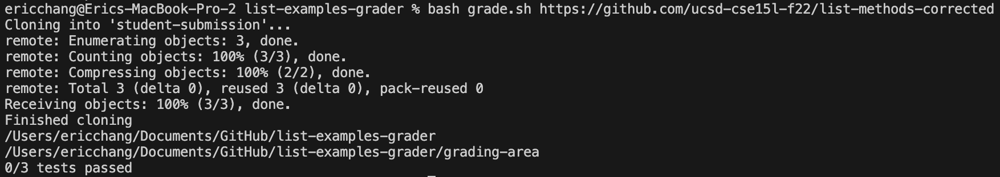
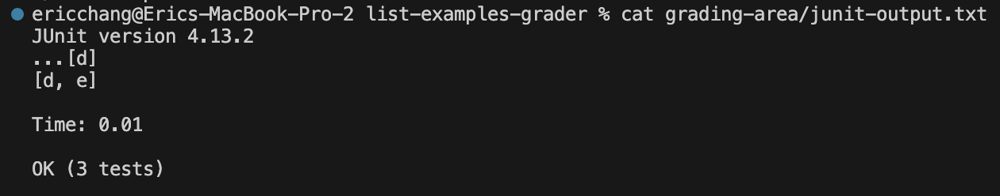

# Lab Report 5
## Part 1
Student:

My grading script fails on the correct input. It says `0/3` tests are correct. I think it is a problem somewhere with my arithmetic but I tested it with hardcoded values and it showed `3/3`.



TA:

Have you looked at the `junit-output.txt` file? There you can see if the tests are actually passing or maybe there was an error in parsing the results.

Student:

Oh you are right! It seems that the correct `ListExamples` methods still printed some debugging output of its own that got mixed into the junit results and messed up my parsing code. When I parse the line of `.` and `E` for number of tests and number of errors, I forgot that the methods could also potentially print output in that line.


--
### Setup:

File structure:
```
grading-area/ (folder and contents created by grade.sh)
    junit-output.txt
    Copied java and class files from student-submission/
student-submission/ (folder and contents created by grade.sh)
    ListExamples.java
grade.sh
TestListExamples.java
```
File contents (only relevant parts shown for brevity):

ListExamples.java
```java
static List<String> filter(List<String> list, StringChecker sc) {
    List<String> result = new ArrayList<>();
    for(String s: list) {
        if(sc.checkString(s)) {
            result.add(s);
            System.out.println(result);
        }
    }
    return result;
}
```
junit-output.txt
```
JUnit version 4.13.2
...[d]
[d, e]

Time: 0.01

OK (3 tests)


```
grade.sh
```bash
java -cp $CPATH org.junit.runner.JUnitCore TestListExamples > junit-output.txt

LINE=$(sed '2q;d' junit-output.txt)
TESTS=$(echo $LINE | tr -cd '.' | wc -m | tr -d ' ')
ERRORS=$((${#LINE} - $TESTS))
SUCCESSES=$(($TESTS - $ERRORS))

echo "$SUCCESSES/$TESTS tests passed"
```
Command:

`bash grade.sh https://github.com/ucsd-cse15l-f22/list-methods-corrected`

Note that the repository given above does not actually print anything, the print was added locally by me to demonstrate the bug. The repository link is just used to demonstrate the command taking some repository as input and grading it.

How to fix:

There is a hacky way to fix this bug that is actually a pure Java solution: by setting up the tests to ignore any other output. The code is shown below and should belong in `TestListExamples.java`:
```java
@Before
public void setup() {
    System.setOut(new PrintStream(OutputStream.nullOutputStream()));
}
```
Questions arise for what should be done to the error stream, and also what should be done if certain output is necessary and expected. If these cases arise, further exploration is needed. But for tests like this one that only tests method return value, this suffices.

## Part 2
One thing I learned from lab that I did not know before was the use of jdb to debug programs. Of course, I had used debugging tools before, like the one built into VSCode. But I didn't know how it worked behind the scenes or how to do it without a graphical user interface. I have also been interested in learning vim, and practicing it in lab has allowed me to effectively edit code on remote devices outside of class.